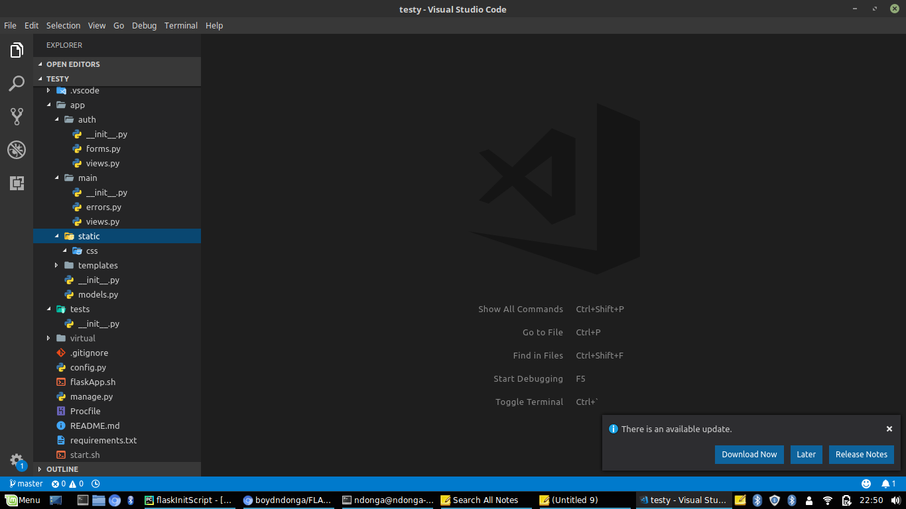

# FLASK_STRUCTURE
this is a script to every lazy developer or any other that seeks to save time creating the whole flask structure

## SETUP

### clone this repository

``` $ git clone https://github.com/boydndonga/FLASK_STRUCTURE.git ```

### make sure you are at its required level

``` $ cd FLASK_STRUCTURE```

### make it executable

``` $ chmod +x flaskApp.sh ```

**create a directory of your project and copy the flaskApp.sh file to that destination then execute it from there responding to the prompts to have your desired configuration**

``` $ ./flaskApp.sh ```

| *Option* | *Output* 
--- | --- 
Should i create a README? | creates a README.md file
create with bootstrap only | initialize bootstrap for use in the app
create with: bootstrap and db | initialize bootstrap and SQLAlchemy in your app
create with: bootstrap,db,authentication | initialize bootstrap, SQLAlchemy and auth blueprnt in your app

### Disclaimer
In the start.sh file it has been set to run on python3.6, change this to your python version
This script doesnt create a database for you ,it just installs the neccesary packages required to integrate a db seamlessly in the app

